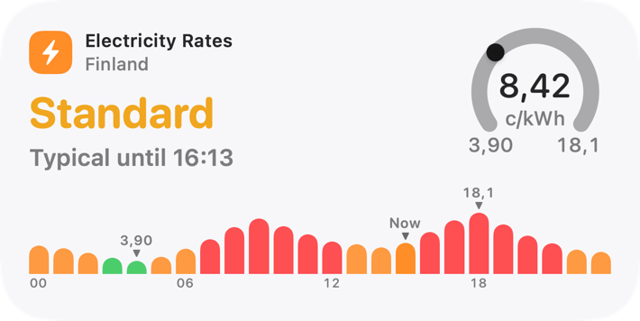
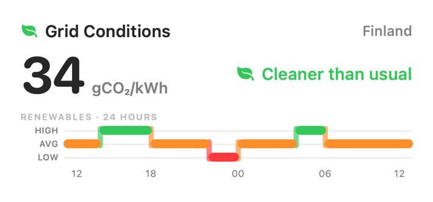
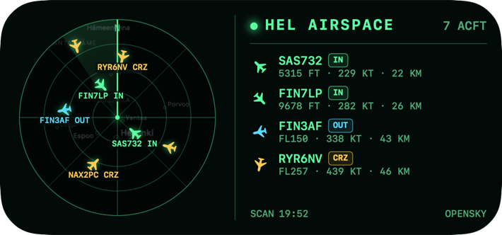

<p align="center">
  
</p>

# SpotPriceWidget

Glanceable Finland electricity prices, grid conditions, and Helsinki airspace for macOS and iOS. The widgets use a compact, Home-inspired visual language designed to answer “what is happening now?” without opening an app.

<p align="center">
  
</p>

## Widgets

- **Finland Electricity Rates** — current VAT-inclusive spot price, price band, range gauge, and the day’s hourly prices. Negative prices are supported.
- **Finland Grid Conditions** — current grid-emissions intensity paired with a forward-looking renewable-energy signal.
- **HEL Airspace Radar** — a compact snapshot of airborne traffic around Helsinki Airport.

<p align="center">
  
  <br>
  
</p>

## Quick install on macOS

You need macOS 26.5 or later and the full Xcode app. Then run:

```bash
curl -fsSL https://raw.githubusercontent.com/phatleatfinepass/SpotPrice-Widget/stable/script/install.sh | bash
```

The installer builds the reviewed `stable` branch locally, signs the result ad hoc, installs it in `~/Applications`, registers the widget extension, and opens the app. It does not use `sudo`, bypass Gatekeeper, or ask for an API key. See [the install guide](docs/INSTALL.md) for options and manual steps.

After installation, open the macOS widget gallery and search for **Finland Electricity Rates**.

## Data and privacy

The app contacts these data providers directly; it has no project-owned server or analytics service:

- Electricity prices: [spot-hinta.fi](https://spot-hinta.fi/)
- Renewable forecast signal: [Energy-Charts](https://api.energy-charts.info/)
- Grid emissions: [Fingrid Open Data](https://data.fingrid.fi/en/)
- Air traffic: [OpenSky Network](https://opensky-network.org/)

Spot prices, the renewable signal, and public OpenSky snapshots are keyless. Fingrid’s emissions endpoint requires a Fingrid API key and therefore shows as unavailable in the public build unless a developer supplies a key locally. No credential is stored in this repository or by the installer.

## Branches

- `stable` is the installable, verified release line.
- `maintenance` is the integration line for fixes and upcoming releases.

Contributions should target `maintenance`. See [CONTRIBUTING.md](CONTRIBUTING.md).

## Build from source

```bash
git clone --branch maintenance https://github.com/phatleatfinepass/SpotPrice-Widget.git
cd SpotPrice-Widget
DEVELOPER_DIR=/Applications/Xcode.app/Contents/Developer \
  xcodebuild -project SpotPriceWidget.xcodeproj \
  -scheme SpotPriceWidget \
  -destination 'platform=macOS' \
  build
```
