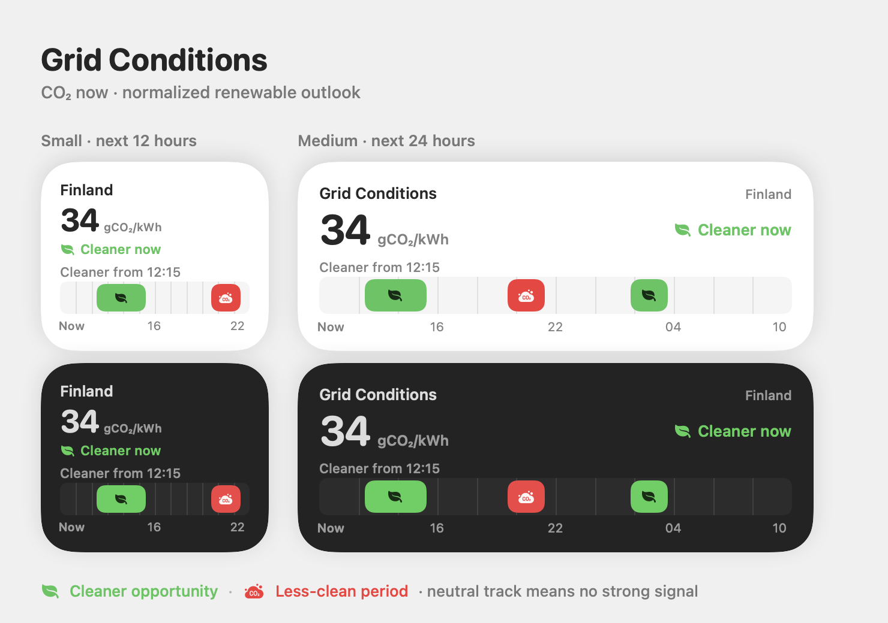

<p align="center">
  
</p>

# SpotPriceWidget

Glanceable Finland electricity prices and grid conditions for macOS and iOS. The widgets use a compact, Home-inspired visual language designed to answer “what is happening now?” without opening an app.

<p align="center">
  
</p>

## Widgets

- **Finland Electricity Rates** — current VAT-inclusive spot price, price band, range gauge, and the day’s hourly prices. Negative prices are supported.
- **Finland Grid Conditions** — live grid-emissions intensity paired with a month-and-hour-normalized renewable outlook. Green and red appear only for strong, sustained forecast periods; neutral stays visually quiet.

<p align="center">
  
</p>

## Download for macOS

Download the latest Universal direct release:

[**Download Finland Electricity Rates for macOS**](https://github.com/phatleatfinepass/SpotPrice-Widget/releases/latest/download/Finland-Electricity-Rates.dmg)

Open the disk image and drag **Finland Electricity Rates** to Applications. The release requires macOS 26.5 or later and does not require Xcode.

This is a free, ad-hoc signed direct release rather than an Apple-notarized Developer ID release. On first launch, macOS may ask you to approve it in **System Settings → Privacy & Security → Open Anyway**. The project never asks you to disable Gatekeeper or remove quarantine protection.

For a Terminal-based installation or update, run:

```bash
curl -fsSL https://raw.githubusercontent.com/phatleatfinepass/SpotPrice-Widget/stable/script/install.sh | bash
```

The installer downloads the latest direct release, verifies its published SHA-256 checksum and embedded code-signature integrity, installs it in `~/Applications`, registers the widget extension, and opens the app. It does not use `sudo`, bypass Gatekeeper, or ask for an API key. See [the install guide](docs/INSTALL.md) for first-launch approval, options, and source-building steps.

The macOS app also includes **Software Update** and **Danger Zone** sections. Software Update checks the official GitHub release, verifies the downloaded disk image against its published SHA-256 checksum, and opens it for installation. Danger Zone can clear rebuildable app data and request fresh widget timelines. Uninstall requires confirmation, moves only the currently running app to the Trash, and closes it; there is no file picker or manual deletion step.

After installation, open the macOS widget gallery and search for **Finland Electricity Rates**.

## Data and privacy

The app uses these data sources and has no account, advertising, or analytics service:

- Electricity prices: [spot-hinta.fi](https://spot-hinta.fi/)
- Renewable forecast signal: [Energy-Charts](https://api.energy-charts.info/)
- Grid emissions: [Fingrid Open Data](https://data.fingrid.fi/en/), through the project’s read-only cache

Spot prices and the renewable signal are keyless. Fingrid requires a registered API credential, so the public release reads one fixed, cached dataset from a small Cloudflare Worker. The credential is an encrypted Worker secret and is never shipped in the app, installer, repository, or public response. Local Debug builds may still call Fingrid directly when a developer supplies a credential outside the repository.

The conservative renewable classifier and its visual semantics are documented in [Grid Conditions signal](docs/GRID-CONDITIONS.md).

## Branches

- `stable` is the installable, verified release line.
- `maintenance` is the integration line for fixes and upcoming releases.

Contributions should target `maintenance`. See [CONTRIBUTING.md](CONTRIBUTING.md).

Product information: [Privacy](PRIVACY.md) · [Support](SUPPORT.md) · [Changelog](CHANGELOG.md)

## Build from source

```bash
git clone --branch maintenance https://github.com/phatleatfinepass/SpotPrice-Widget.git
cd SpotPrice-Widget
DEVELOPER_DIR=/Applications/Xcode.app/Contents/Developer \
  xcodebuild -project SpotPriceWidget.xcodeproj \
  -scheme SpotPriceWidget \
  -destination 'platform=macOS' \
  build
```
